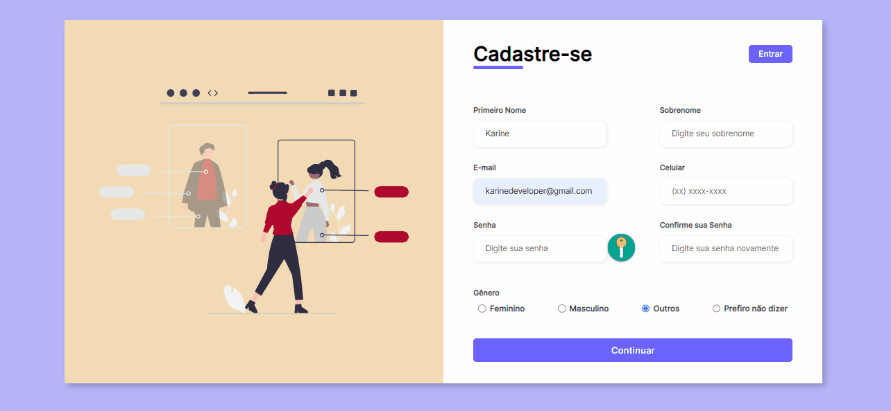

# Projeto Formulário Responsivo

## Descrição
    Treinamento de confecção de formulário responsivo, usando flexbox, seguindo a video aula da Larissa Kish no youtube.

## Meu Processo

    •	Marcação semântica HTML5
    •	Propriedades personalizadas de CSS3
    •	Flexbox
    •	Design responsivo

## Design

### Desktop e Responsivo

## Autor

 GitHub: <a href="https://github.com/devkarine">DevKarine</a>  
FrontEndMentor: <a href="https://www.frontendmentor.io/profile/devkarine">@devkarine</a>  
CodePen: <a href="https://codepen.io/devkarine">DevKarine</a>  
linkedIn: <a href="https://www.linkedin.com/in/devkarine/">Karine Pereira</a>  

### Créditos do video
Video-aula: <a href="https://www.youtube.com/watch?v=zWw0npNDkVM">Larissa Kich</a>  